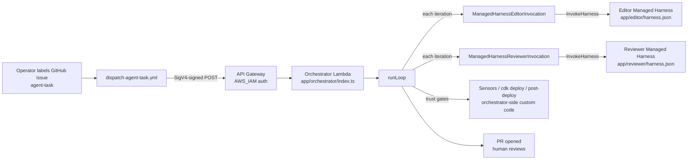

# Design Document

## Overview

This spec wires the `agent-harness` template end-to-end against AWS Bedrock AgentCore Managed Harness. There are two intertwined parts:

1. **Terminology fix.** The docs (`README.md`, `docs/quickstart.md`, `post-draft.md`) currently say "AgentCore Harness" — a phrase that, since the docs were written, has become an AWS product name for a specific preview feature: AgentCore Managed Harness. The docs must say "AgentCore Managed Harness" everywhere the template uses the feature, and they must clarify that this template uses Managed Harness with a custom orchestrator on top (not AgentCore Runtime, which is the code-based deployment mode).

2. **End-to-end wiring.** Today the template stops at "the dispatch workflow POSTs to a placeholder AgentCore endpoint." This spec fills the gap so a labelled GitHub issue actually drives the editor agent through `runLoop()` and opens a PR. Concretely: declare two Managed Harness configs (editor + reviewer), implement two `InvokeHarness`-backed invocation classes, write a Lambda orchestrator that calls `runLoop()`, deploy the orchestrator behind an IAM-authenticated API Gateway, and add a smoke test.

The shape of the resulting system:



The split that matters: the editor and reviewer agents live inside Managed Harness (config-file-driven, AWS-managed loop). The trust gates — sensors, `cdk deploy`, the post-deploy harness — stay on the orchestrator side as custom code, because that is where the template's value sits and what forkers most often replace.

The `runLoop()` implementation already exists at `harness/loop/src/run.ts`; this spec does not change it. The orchestrator's job is to build the `LoopGates` interface from real `InvokeHarness` clients and wire `runLoop()` into a Lambda handler.

## Architecture

### Layering

The architecture has four distinct layers, each owning a concern:

| Layer | Component | Owned by this spec? |
|---|---|---|
| Trigger transport | GitHub Actions workflow → API Gateway → Lambda | Yes — wires SigV4 + IAM auth |
| Orchestration | `runLoop()` driving editor/reviewer/gates | No — already implemented; this spec wires it |
| Agent execution | AgentCore Managed Harness (editor, reviewer) | Yes — declares `harness.json` configs and `InvokeHarness` clients |
| Trust gates | Sensors, CDK deploy, post-deploy harness | No — already implemented; this spec wires them into `LoopGates` |

The boundary between "orchestration" and "agent execution" is crucial. The orchestrator lives in our code and runs the bounded loop. The agent execution lives inside Managed Harness, which is AWS-managed: we describe the agent declaratively (model, system prompt, tool catalogue, iteration cap) and AWS runs the per-turn agent loop. We invoke one turn at a time via `InvokeHarness`.

### Why Managed Harness, not Runtime

AgentCore has two deployment modes:

- **Managed Harness (preview):** Declarative. You write a `harness.json` describing the agent (model, system prompt, tool catalogue, memory, iteration cap). `agentcore deploy` produces a harness ARN. Callers invoke with `InvokeHarness(harnessArn, sessionId, input)` and get back streamed tool calls + final output.
- **Runtime:** Code-based. Two deployment modes per the [AWS docs](https://docs.aws.amazon.com/bedrock-agentcore/latest/devguide/runtime-get-started-code-deploy.html): (1) **direct code deployment**, where you package agent code and dependencies into a `.zip` archive and AgentCore manages the language runtime environment (Python or Node.js) under a shared-responsibility split that the AWS docs describe as similar to Lambda's — Lambda is *not* a deployment target for AgentCore Runtime; the analogy is only about who patches the runtime; and (2) **container deployment**, where you supply a Docker container (ARM64) exposing `POST /invocations` and `GET /ping` endpoints. Either way, AgentCore Runtime runs each session in a dedicated microVM with isolated CPU, memory, and filesystem (sessions persist up to 8 hours, with `runtimeSessionId` as the key), and you write your own per-turn loop.

This template uses Managed Harness for editor and reviewer because the **editor's intra-turn tool-calling loop** (the inner "model thinks → calls tool → reads tool output → thinks again" cycle for one turn) is exactly the kind of thing forkers should not have to maintain. AWS owns it; the harness config declares the tool surface and AWS runs the per-turn loop.

The **outer bounded loop** — editor → sensors → reviewer → deploy → post-deploy → maybe iterate → maybe open PR — is a different concern and stays in our code (see "Why the outer loop stays in our code, not Strands workflow," below). Conflating these two loops is a real source of confusion, and is part of why the docs need the terminology fix called out in Requirement 1.

### Why the outer loop stays in our code, not Strands workflow

A reasonable alternative is to express the outer bounded loop as a [Strands workflow / multiagent graph](https://strandsagents.com/docs/api/python/strands.multiagent.graph/), with each gate as a node and edges describing the success/failure transitions. We considered this and rejected it for this spec. The reasoning:

1. **Most outer-loop "nodes" are not agents.** Of the six gate calls (`runEditor`, `runSensors`, `runReviewer`, `runDeploy`, `runPostDeploy`, `openPR`), only two are LLM invocations. The other four are deterministic shell-outs (`tsc`, `eslint`, `cdk-nag`, `jest`, `cdk deploy`, the post-deploy smoke test) or AWS/GitHub API calls. Strands graphs are designed for agents-as-nodes; wiring deterministic subprocesses as nodes is possible (custom callables) but loses most of the framework's value and adds an indirection.

2. **Stop conditions are interleaved, not edges.** `runLoop()` evaluates five stop conditions (iteration cap, wall-clock cap, token-spend cap, oscillation detection, kill-switch GitHub label poll) at five points per iteration — before each gate. That isn't a static graph shape; it's a "between every node, evaluate five orthogonal cutoffs and either continue or terminate with a specific reason" pattern. Encoding it as graph edges would mean an edge from every node to every termination outcome with a guard expression on each — it works, but is harder to read than the explicit while-loop that exists today.

3. **Durable session persistence after every gate is part of the loop's contract.** `runLoop()` writes the `Session` to a `SessionStore` after each iteration *and* after each failed gate, so a partial PR can surface honest progress on termination. A graph executor handles its own internal state; layering "after each node, persist this external durable record" is extra plumbing that doesn't shrink.

4. **`runLoop()` is already built, tested, and pinned by prior requirements.** It exists at `harness/loop/src/run.ts` with the contract documented in the `feature-change-loop` spec. Requirement 7.1 of *that* spec specifies the loop body's pseudo-code. This `agentcore-e2e-smoke` spec does not redesign the loop; it wires it. Replacing `runLoop()` with a Strands workflow would be a separate, larger spec — and would still have to handle (1)–(3) above.

5. **The split is also a forking story.** Forkers replace the trust gates (sensors, deploy, post-deploy harness) with whatever fits their domain. Keeping those gates as plain callables in our code means forkers edit TypeScript that does what it says. Putting them inside a graph framework adds a second layer of abstraction (graph node wrapping subprocess wrapping toolchain) that obscures rather than helps.

If a future spec wants to introduce Strands workflow as the outer loop — perhaps when the cross-cutting concerns of (1)–(3) have been addressed in the framework — that's a clean swap to consider. The `LoopGates` interface is the seam: the same gate implementations could be wrapped as graph nodes without changing the gate code itself. For now, the explicit loop is clearer and matches the existing requirements.

### Request flow

For one trigger:

1. Operator applies `agent-task` label to a GitHub issue.
2. `dispatch-agent-task.yml` extracts fields from the issue body, builds the trigger payload, and SigV4-signs a POST against the orchestrator's API Gateway URL using the `agent-harness-github-runner` role's credentials (assumed via the existing OIDC step).
3. API Gateway authenticates the request via `AWS_IAM` authorization. If the SigV4 signature is invalid or the role is not authorized, returns 403; the workflow surfaces this as an issue comment.
4. API Gateway invokes the orchestrator Lambda with the request body.
5. The Lambda handler:
   - Parses the trigger payload into a `Session` object.
   - Constructs `ManagedHarnessEditorInvocation` (configured with the editor harness ARN from the env var).
   - Constructs `ManagedHarnessReviewerInvocation` (configured with the reviewer harness ARN).
   - Builds `LoopGates`: `runEditor` → editor invocation; `runReviewer` → reviewer invocation; `runSensors`, `runDeploy`, `runPostDeploy` → existing local runners.
   - Calls `runLoop({ session, store, config, killSwitchPoll, gates })`.
6. `runLoop()` drives the iterations. Each iteration:
   - Calls `gates.runEditor(context)` → editor `InvokeHarness` call → editor agent thinks, calls tools, produces edits.
   - Calls `gates.runSensors()` → local subprocess (`tsc`, `eslint`, `cdk-nag`, `jest`).
   - Calls `gates.runReviewer(diff)` → reviewer `InvokeHarness` call.
   - Calls `gates.runDeploy()` → local `cdk deploy` against the preview env.
   - Calls `gates.runPostDeploy()` → local post-deploy harness.
7. On success or stop condition, `runLoop()` opens a PR and returns.
8. The Lambda writes the termination reason and PR number into the API Gateway response body and returns 200.

### Lambda execution-cap caveat

AWS Lambda has a 15-minute execution cap. A typical iteration takes ~2–3 minutes (one InvokeHarness call for editor, sensors locally, one InvokeHarness call for reviewer, `cdk deploy`, post-deploy). The default `iterationCap = 5` from `agent-harness.config.json` fits inside 15 minutes for typical sessions. Operators wanting longer loops will need a different host (Step Functions for state-machine orchestration, ECS task for arbitrarily long compute). That's acknowledged in a comment at the top of `app/orchestrator/index.ts` and in the "Out of scope" section here.

### Why API Gateway, not function URL

The simpler option would be a Lambda function URL. We use API Gateway instead because:

- API Gateway natively supports `AWS_IAM` authorization at the route level. SigV4-signed requests are validated server-side without writing custom auth code.
- The GitHub runner role already gets credentials via OIDC; granting it `execute-api:Invoke` on the specific API Gateway resource ARN is a single IAM statement.
- Function URLs have IAM auth too, but their signing model is less broadly documented and the existing IAM stack pattern (and the operator's mental model of "API Gateway in front of Lambda") fits better.

### Naming conventions

| Concept | Existing identifier | New identifier introduced here |
|---|---|---|
| Project root config for AgentCore | `agent-harness.config.json` (already exists, keeps the same role) | `agentcore/agentcore.json` (new — the AgentCore project descriptor) |
| Per-agent harness config | None | `app/editor/harness.json`, `app/reviewer/harness.json` |
| AgentCore endpoint URL | `agentcore.endpoint` (placeholder) | `orchestrator.apiGatewayEndpoint` (replaces it) |
| Editor invocation class | None (was a stub in `agents/editor/agent.ts` referring to "Strands SDK") | `ManagedHarnessEditorInvocation` in `agents/editor/managed-harness-invocation.ts` |
| Reviewer invocation class | `StrandsReviewerInvocation` (throws `StrandsNotImplementedError`) | `ManagedHarnessReviewerInvocation` in `harness/scheduled-reviewer/src/run.ts` |
| Lambda handler | None | `app/orchestrator/index.ts` |
| Orchestrator CDK stack | None | `infrastructure/orchestrator-stack.ts` |
| Smoke test | None | `scripts/smoke-test.ts` |

The `app/` prefix is new. Reasoning: `harness.json` and the orchestrator Lambda are deployed AWS artifacts (a harness ARN and a Lambda ARN respectively), not engineering-harness scaffolding. Putting them under `app/` distinguishes them from `harness/` (which holds the engineering harness — sensors, post-deploy, loop runner) and `agents/` (which holds the agent definitions — system prompts, tool catalogues, agent.ts seams).

## Components and Interfaces

### `app/editor/harness.json` — Editor Managed Harness config

A declarative description of the editor agent that AgentCore deploys. The shape follows the Managed Harness preview format (resolved during implementation against the AgentCore CLI's schema). Key fields:

```jsonc
{
  "name": "editor-agent",
  "model": "${models.editor from agent-harness.config.json}",
  "systemPrompt": { "$ref": "../../agents/editor/system.md" },
  "tools": [
    "module.readFile", "module.writeFile", "module.listFiles", "module.diff",
    "cdk.diff", "cdk.deploy",
    "sensor.cdkNag", "sensor.tsc", "sensor.eslint", "sensor.unitTests",
    "preview.cwLogs", "preview.cwMetrics",
    "reviewer.invoke", "postDeploy.invoke", "pr.open"
  ],
  "memory": { "type": "session" },
  "iterationCap": "${limits.iterationCap from agent-harness.config.json}"
}
```

The exact field names and `$ref` resolution mechanism follow the AgentCore Managed Harness preview schema; values that mirror `agent-harness.config.json` are populated by `agentcore deploy` from environment-substitution variables. The 15 tool names match `EDITOR_TOOL_NAMES` exactly (the existing constant in `agents/editor/agent.ts`).

The full editor tool surface includes `reviewer.invoke` (the editor calling the reviewer as a tool, mid-iteration) — that's distinct from the orchestrator-side `runReviewer` gate (which runs the standalone reviewer at the end of each iteration after edits are complete). Both exist intentionally: the editor uses `reviewer.invoke` for mid-iteration consultation; `runReviewer` is the fixed gate that runs once per iteration regardless.

### `app/reviewer/harness.json` — Reviewer Managed Harness config

Same shape, restricted tool catalogue:

```jsonc
{
  "name": "reviewer-agent",
  "model": "${models.reviewer from agent-harness.config.json}",
  "systemPrompt": { "$ref": "../../agents/reviewer/system.md" },
  "tools": [
    "module.readFile", "module.diff", "reference.checklist"
  ],
  "memory": { "type": "session" },
  "iterationCap": "${limits.iterationCap from agent-harness.config.json}"
}
```

The three reviewer tools match `REVIEWER_TOOL_NAMES` from `agents/reviewer/tools.ts`. No write tools, no CDK tools — same restricted surface as today.

### `agentcore/agentcore.json` — AgentCore project descriptor

```jsonc
{
  "project": "agent-harness",
  "account": "${AWS_ACCOUNT_ID}",
  "region": "${agentcore.regionalRouting from agent-harness.config.json}",
  "harnesses": [
    { "name": "editor-agent",   "config": "../app/editor/harness.json" },
    { "name": "reviewer-agent", "config": "../app/reviewer/harness.json" }
  ]
}
```

The `agentcore deploy` CLI from `@aws/agentcore@preview` reads this file and produces two harness ARNs as output:

```
arn:aws:bedrock-agentcore:<region>:<account>:harness/editor-agent/<id>
arn:aws:bedrock-agentcore:<region>:<account>:harness/reviewer-agent/<id>
```

The operator captures these ARNs and passes them as CDK context when deploying `infrastructure/orchestrator-stack.ts`. The orchestrator's IAM policy scopes `bedrock-agentcore:InvokeHarness` to exactly these two ARNs.

### `ManagedHarnessEditorInvocation` (in `agents/editor/managed-harness-invocation.ts`)

A class implementing `LoopGates.runEditor()` by calling `InvokeHarness`. New file (does not modify the existing `agents/editor/agent.ts` data layer).

```ts
import { BedrockAgentCoreClient, InvokeHarnessCommand } from "@aws-sdk/client-bedrock-agentcore";
import type { LoopContext, EditorResult } from "@agent-harness/loop";

export interface ManagedHarnessEditorInvocationOptions {
  readonly harnessArn: string;
  readonly sessionId: string;
  readonly client?: BedrockAgentCoreClient;  // injectable for tests
}

export class ManagedHarnessEditorInvocation {
  private readonly client: BedrockAgentCoreClient;
  private readonly harnessArn: string;
  private readonly sessionId: string;

  public constructor(options: ManagedHarnessEditorInvocationOptions) {
    this.harnessArn = options.harnessArn;
    this.sessionId = options.sessionId;
    this.client = options.client ?? new BedrockAgentCoreClient({});
  }

  public async runEditor(context: LoopContext): Promise<EditorResult> {
    // 1. Serialise LoopContext into the harness's input format (JSON string of trigger + history).
    // 2. Issue InvokeHarnessCommand against this.harnessArn with this.sessionId.
    // 3. Consume the streaming response, accumulating edits the agent emits during this turn.
    // 4. Return EditorResult { edits: [...] }.
    // On error: throw — the caller (runLoop) will treat as a sensor-class failure.
  }
}
```

Why a class rather than a function: the harness ARN and session ID are stable across calls within one session, but the SDK client is reusable across iterations (connection pooling). A class lets the orchestrator instantiate once per session and pass through `runEditor` as a method reference.

Why a separate file rather than extending `agents/editor/agent.ts`: that file holds the data-only `EditorAgentDefinition` (model, system prompt, tools) that loads from disk and is sharable between contexts (orchestrator, tests, scheduled runs). The `InvokeHarness` client is runtime-only — it has SDK lifecycle and credentials. Mixing the two would force every test that imports `EditorAgentDefinition` to also resolve the AWS SDK. Keeping them separate maintains the data/runtime split that already shapes the codebase.

### `ManagedHarnessReviewerInvocation` (in `harness/scheduled-reviewer/src/run.ts`)

Replaces the existing `StrandsReviewerInvocation` stub. Implements the existing `StandaloneReviewerInvocation` interface so callers (the scheduled reviewer workflow, and now the orchestrator) don't change shape:

```ts
export class ManagedHarnessReviewerInvocation implements StandaloneReviewerInvocation {
  private readonly client: BedrockAgentCoreClient;
  private readonly harnessArn: string;
  private readonly sessionId: string;

  public constructor(options: { harnessArn: string; sessionId: string; client?: BedrockAgentCoreClient }) {
    this.harnessArn = options.harnessArn;
    this.sessionId = `${options.sessionId}-reviewer`;
    this.client = options.client ?? new BedrockAgentCoreClient({});
  }

  public async invoke(diffOrInput?: { diff: string }): Promise<StandaloneReviewerResult> {
    // 1. Build input: scheduled-reviewer mode uses no diff (reviewer reads main); 
    //    in-loop mode uses the diff supplied by runLoop's runReviewer call.
    // 2. Issue InvokeHarnessCommand against this.harnessArn with the per-session id.
    // 3. Consume streaming response, parse the agent's final structured output 
    //    into { findings, tokenCostUSD, modelVersion }.
    // 4. On error: see Error Handling section — populate available partial fields 
    //    when applicable, then propagate.
  }
}
```

The session id format `<sessionId>-reviewer` is a convention to keep editor and reviewer sessions distinct in AgentCore's session store while remaining traceable back to the orchestrator's session id.

The existing `StrandsReviewerInvocation` and `StrandsNotImplementedError` exports are removed. Callers (the existing scheduled-reviewer entry point and tests) are updated to use `ManagedHarnessReviewerInvocation` directly.

### Orchestrator `LoopGates` adapter (in `app/orchestrator/index.ts`)

The orchestrator constructs a `LoopGates` object whose `runEditor` and `runReviewer` delegate to the Managed Harness invocations, and whose other methods reuse the existing local runners:

```ts
const editorInvocation = new ManagedHarnessEditorInvocation({
  harnessArn: process.env.EDITOR_HARNESS_ARN!,
  sessionId: session.trigger.session.id,
});
const reviewerInvocation = new ManagedHarnessReviewerInvocation({
  harnessArn: process.env.REVIEWER_HARNESS_ARN!,
  sessionId: session.trigger.session.id,
});

const gates: LoopGates = {
  runEditor:     (ctx) => editorInvocation.runEditor(ctx),
  runReviewer:   async (diff) => {
    const r = await reviewerInvocation.invoke({ diff });
    return adaptReviewerResultToReviewerResult(r);  // shape adaptation
  },
  runSensors:    () => runLocalSensors(/* config */),
  runDeploy:     () => runLocalCdkDeploy(/* config */),
  runPostDeploy: (stackOutputs) => runLocalPostDeploy(stackOutputs),
  openPR:        (body, partial) => openGitHubPR(body, partial /* config */),
};

const result = await runLoop({ session, store, config, killSwitchPoll, gates });
```

The `adaptReviewerResultToReviewerResult` helper exists because `StandaloneReviewerResult` (`{ findings, tokenCostUSD, modelVersion }`) and `runLoop`'s `ReviewerResult` (`{ findings, passed, severityCounts }`) are different shapes. The adapter computes `passed` and `severityCounts` from `findings` using the same logic as `agents/reviewer/agent.ts`'s output-validation pass.

The local runners (`runLocalSensors`, `runLocalCdkDeploy`, `runLocalPostDeploy`, `openGitHubPR`) are thin wrappers around existing implementations in `agents/editor/tools/sensors.ts`, `agents/editor/tools/cdk.ts`, `harness/post-deploy/src/runner.ts`, and `agents/editor/tools/pr.ts` respectively. They unwrap the tool-shape (`{output, cost}`) into the shape `LoopGates` expects.

### Lambda handler (in `app/orchestrator/index.ts`)

```ts
import type { APIGatewayProxyHandler } from "aws-lambda";

// AWS Lambda has a 15-minute execution cap. The smoke test is sized so a typical
// 2–4 iteration run completes inside that cap. Operators running longer loops
// will need a different host (Step Functions, ECS task) — out of scope here.
export const handler: APIGatewayProxyHandler = async (event) => {
  try {
    const trigger = JSON.parse(event.body ?? "{}");
    const session = createSessionFromTrigger(trigger);
    const gates = buildGates(session);
    const result = await runLoop({ session, store: new InMemorySessionStore(), config, killSwitchPoll, gates });
    return {
      statusCode: 200,
      body: JSON.stringify({ terminationReason: result.terminationReason, prNumber: result.prNumber }),
    };
  } catch (err) {
    console.error("Orchestrator failed:", err);
    return { statusCode: 500, body: JSON.stringify({ error: String(err) }) };
  }
};
```

The handler intentionally does not retry on failure: API Gateway returns 500 to the dispatch workflow, which surfaces the failure as an issue comment using the existing failure-comment pattern in `dispatch-agent-task.yml`. If the operator wants to retry, they remove and re-apply the `agent-task` label.

Response writes are conditional on `runLoop()` actually returning. If anything before `runLoop()` throws, or if `runLoop()` itself throws, the catch block returns 500 — no 200 response is constructed in that path.

### `infrastructure/orchestrator-stack.ts`

A new CDK stack that creates:

1. **Orchestrator Lambda function.** Entry point `app/orchestrator/index.ts`, Node.js 20.x runtime, 15-minute timeout (the maximum Lambda allows), 1024 MB memory (sufficient for the SDK clients and JSON marshalling; not a tight constraint).

2. **API Gateway REST API.** Single `POST /orchestrate` route with `AWS_IAM` authorization. Lambda integration. The API resource ARN is exported as a stack output for the IAM stack to consume.

3. **Lambda execution role.** Policy:
   - `bedrock-agentcore:InvokeHarness` on exactly two resources: the editor harness ARN and the reviewer harness ARN, supplied as CDK context (`--context editorHarnessArn=… --context reviewerHarnessArn=…`).
   - CloudWatch Logs write permissions for the Lambda's own log group (standard AWS-managed `AWSLambdaBasicExecutionRole` or equivalent).
   - The trust gates' permissions (CDK deploy, sensor execution, post-deploy AWS calls, GitHub) are inherited from the existing `agent-harness-editor` role pattern. The Lambda execution role gets `sts:AssumeRole` on `agent-harness-editor` and the trust gates run their AWS calls via assumed credentials. *(Alternative: hand the existing editor role permissions directly to the Lambda execution role. Either works; the assume-role pattern keeps the existing role's audit boundary intact.)*

4. **API Gateway resource ARN export.** Exported as `OrchestratorApiResourceArn` for `iam-stack.ts` to consume when granting `execute-api:Invoke` on that exact ARN.

The stack reads the editor and reviewer harness ARNs from CDK context. If they are not supplied, the stack synthesis fails with a clear error message naming the missing context keys.

### `infrastructure/iam-stack.ts` modifications

The existing `agent-harness-github-runner` role currently grants `bedrock:InvokeAgent` on the `agentCoreAgentArn` prop. This spec replaces that grant with `execute-api:Invoke` on the orchestrator API Gateway's resource ARN. The role's existing OIDC trust policy is unchanged.

The `agentCoreAgentArn` prop is removed from `IamStackProps` (no longer needed). A new prop, `orchestratorApiResourceArn`, takes its place and is supplied by the operator after the orchestrator stack deploys (or via a CloudFormation cross-stack `Fn::ImportValue` reference to the orchestrator stack's `OrchestratorApiResourceArn` export).

The runner role's `InvokeAgentCore` policy statement is replaced with:

```ts
this.githubActionRunnerRole.addToPolicy(
  new iam.PolicyStatement({
    sid: "InvokeOrchestratorApiGateway",
    effect: iam.Effect.ALLOW,
    actions: ["execute-api:Invoke"],
    resources: [props.orchestratorApiResourceArn],
  })
);
```

Both the editor agent role and reviewer agent role in `iam-stack.ts` stay as-is; AgentCore Managed Harness manages the agents' execution-time credentials through its own role pinning during `agentcore deploy`. The IAM stack's editor/reviewer roles continue to reflect the trust-gate scope (CDK deploy, CloudWatch read on preview), which is what the orchestrator's `runSensors`/`runDeploy`/`runPostDeploy` gates use.

### `.github/workflows/dispatch-agent-task.yml` modifications

The "POST payload to AgentCore" step (step 10) is renamed to "POST payload to orchestrator API Gateway" and its `curl` invocation is replaced with a SigV4-signed POST. The runner role's credentials are already assumed via the existing OIDC step; signing reuses those credentials.

Two implementation options for the SigV4 signing in bash:

- **Option A (preferred):** Use `awscurl` (small Python or Go helper) — `awscurl --service execute-api -X POST -d @payload.json "$ORCHESTRATOR_API_GATEWAY_ENDPOINT"`. Compact, well-understood, depends on a small extra tool.
- **Option B:** Use the AWS CLI's `apigateway test-invoke-method` — different semantics (server-side simulation, no actual API Gateway invocation) so this doesn't fit.
- **Option C:** Use a short Node.js inline script with `@aws-sdk/signature-v4` — works, but adds a dependency to the workflow runner. Defer unless `awscurl` proves problematic.

The endpoint URL is read from `agent-harness.config.json` `orchestrator.apiGatewayEndpoint` (the new field replacing `agentcore.endpoint`):

```bash
ORCHESTRATOR_ENDPOINT=$(jq -r '.orchestrator.apiGatewayEndpoint' agent-harness.config.json)
awscurl --service execute-api -X POST -d @/tmp/payload.json "$ORCHESTRATOR_ENDPOINT"
```

The existing failure-comment pattern handles non-2xx responses — this stays intact, so a 403 from API Gateway (invalid signature, missing IAM grant) still becomes a comment on the issue.

### `scripts/smoke-test.ts`

A script that exercises the full flow without manual intervention:

```ts
// 1. Read GitHub repo and orchestrator endpoint from agent-harness.config.json.
// 2. Create a GitHub issue with title "[smoke-test] <timestamp>" and label "agent-task".
// 3. Poll for the dispatch-agent-task.yml workflow run to start (default 30s interval, 10min timeout).
// 4. Poll for a PR to be opened referencing the issue (default 60s interval, 90min timeout).
// 5. Print structured summary: issue number, workflow run URL, PR number, elapsed time, pass/fail.
// 6. Close the issue (always; on pass and on fail). Leave the PR open for manual review.
// 7. Exit 0 on pass, non-zero on fail.
```

Implementation uses the GitHub REST API via `fetch` (or the GitHub CLI `gh` shelling out, whichever is simpler). Read the GitHub repo from `agent-harness.config.json` rather than env vars so an operator with the repo cloned can `npx ts-node scripts/smoke-test.ts` without setup.

Polling intervals and timeouts are CLI flags with the documented defaults; the smoke test is also runnable in CI with shorter timeouts if needed.

## Data Models

### Trigger payload (existing — flows from dispatch workflow into orchestrator Lambda)

The trigger payload shape is already defined in `dispatch-agent-task.yml` and consumed by `createSessionFromTrigger` in `harness/loop/src/session.ts`. This spec does not change the shape. Reproduced here for reference:

```ts
interface TriggerPayload {
  schemaVersion: "1.0";
  triggerType: "feature-change" | "fitness-gap";
  issue: { number: number; title: string; body: string; url: string; openedBy: string };
  module: { path: string; repository: string; ref: string; commitSha: string };
  session: { id: string; createdAt: string };
  limits: { iterationCap: number; wallClockCapMinutes: number; tokenSpendCapUSD: number };
  auth: { githubInstallationToken: string };
  // Optional, present only when triggerType === "fitness-gap":
  originatingFinding?: { /* ...as defined in fitness-gap-loop spec... */ };
}
```

### `InvokeHarness` request and response (new)

The exact shape comes from `@aws-sdk/client-bedrock-agentcore`. As of preview, the relevant types are roughly:

```ts
interface InvokeHarnessRequest {
  harnessArn: string;
  sessionId: string;
  input: string;  // serialized JSON; harness defines its own input contract
}

// Streaming response. The response body is a stream of events.
type InvokeHarnessEvent =
  | { type: "tool-call";   tool: string; input: unknown }
  | { type: "tool-result"; tool: string; output: unknown }
  | { type: "thought";     text: string }
  | { type: "final";       output: unknown };  // last event in stream
```

The exact event types follow whatever the Managed Harness preview SDK exposes. The invocation classes consume the stream, accumulate `tool-call` and `tool-result` events into the structured edit/finding output, and use the `final` event's `output` as the agent's last word.

### `EditorResult` (existing — `harness/loop/src/run.ts`)

```ts
interface EditorResult {
  readonly edits: ReadonlyArray<{ readonly path: string; readonly diff: string }>;
}
```

`ManagedHarnessEditorInvocation.runEditor()` populates this from the `tool-result` events of `module.writeFile` calls (which is how the editor actually emits edits — by calling the `writeFile` tool with `{path, contents}`). The `diff` field is computed from the file contents before/after the writeFile call.

Implementation note: the edit-accumulation logic walks the streaming response and, for each `module.writeFile` tool result, records `{path, diff}`. Other tool calls (`cdk.diff`, `sensor.tsc`, `reviewer.invoke`) are ignored at this layer — they have already executed via the Managed Harness tool wrappers and don't produce orchestrator-visible state changes. Only `module.writeFile` mutates the working tree.

### `StandaloneReviewerResult` (existing — `harness/scheduled-reviewer/src/run.ts`)

```ts
interface StandaloneReviewerResult {
  readonly findings: ReadonlyArray<ReviewerFinding>;
  readonly tokenCostUSD: number;
  readonly modelVersion: string;
}
```

`ManagedHarnessReviewerInvocation.invoke()` populates this from the `final` event's `output`, which the reviewer's system prompt instructs the model to produce as a JSON object matching the `ReviewerOutput` schema. Token cost comes from the response's metadata.

### Lambda response body

```ts
interface OrchestratorResponse {
  // 200 case:
  terminationReason?: TerminationReason;  // success | iteration-cap | wall-clock-cap | token-cap | kill-switch | oscillation
  prNumber?: number | null;
  // 500 case:
  error?: string;
}
```

The dispatch workflow does not parse the response body today (it just checks the status code). The smoke test does parse it to determine pass/fail without polling for the PR.

### `agent-harness.config.json` schema delta

Three changes to the existing config:

```jsonc
{
  // REMOVE: "agentcore.endpoint"
  "orchestrator": {
    "apiGatewayEndpoint": "https://<api-id>.execute-api.<region>.amazonaws.com/prod/orchestrate"
  },
  "agentcore": {
    // KEEP: "regionalRouting" — agentcore.json reads this
    "regionalRouting": "us-east-1"
  },
  "versions": {
    // CHANGE: replace "agentcoreSdk" placeholder with the resolved version
    "agentcoreSdk": "<resolved version of @aws/agentcore@preview>",
    // ADD: bedrockAgentCoreSdk
    "bedrockAgentCoreSdk": "<exact version of @aws-sdk/client-bedrock-agentcore>"
    // REMOVE: "strands" (template no longer depends on Strands)
  }
}
```

The schema at `schemas/agent-harness-config.schema.json` is updated in lockstep so `scripts/validate-config.ts` continues to pass.

## Error Handling

### `InvokeHarness` failures

Three error classes:

1. **Network or SDK errors** (timeout, connection reset, AWS service unavailable): the SDK throws. Both invocation classes propagate the throw without catching. `runLoop()` treats the throw as a sensor-class failure: it records the iteration as failed, evaluates stop conditions, and either iterates or terminates with the appropriate reason. This matches how `runLoop()` already handles tool failures elsewhere.

2. **Authorization failures (403):** the orchestrator's IAM policy is misconfigured or the harness ARNs are wrong. The SDK throws an `AccessDeniedException`. Same treatment as (1) — propagate. The Lambda's catch block returns 500; the dispatch workflow comments on the issue.

3. **Malformed agent output:** the Managed Harness streamed a response, but the `final` event's output doesn't match the expected shape (e.g., reviewer's output is missing `findings`, or the editor produced no `module.writeFile` results despite the loop expecting edits).
   - For the **reviewer**: `ManagedHarnessReviewerInvocation` attempts to populate available partial fields (e.g., if `findings` is present but `tokenCostUSD` is missing, default it to 0; if `findings` is malformed, return an empty array) and then propagates the original parse error. The scheduled reviewer workflow exits non-zero, GitHub Actions surfaces the failure. This matches Requirement 2.6.
   - For the **editor**: an empty `EditorResult` is a legitimate outcome (the agent decided nothing needed editing this turn). Malformed output (e.g., the stream ended without a `final` event) is propagated as an error per Requirement 3.3.

### Lambda timeouts

Lambda has a 15-minute hard cap. If `runLoop()` is mid-iteration when the cap is reached, the Lambda is terminated by AWS (no graceful handler). API Gateway returns 504. The dispatch workflow surfaces this as a failure comment.

The wall-clock cap inside `runLoop()` (default 60 minutes from `agent-harness.config.json` `limits.wallClockCapMinutes`) is *not* the protection here: the Lambda cap is shorter and bites first. The orchestrator's documentation comment names this explicitly.

### API Gateway authorization failures

If the dispatch workflow's SigV4 signature is invalid, or the runner role lacks `execute-api:Invoke` on the API Gateway resource, API Gateway returns 403 *before* invoking the Lambda. This is by design: the Lambda never sees the request, so there's no risk of partial execution on auth failure. The dispatch workflow's existing failure-comment pattern handles the 403 the same as any other non-2xx.

### Schema validation failures at the workflow boundary

The trigger payload's structure is validated by `dispatch-agent-task.yml`'s existing field-extraction logic before the POST happens. If validation fails, the workflow comments on the issue and exits non-zero before the orchestrator is called. This existing behaviour stays intact.

The orchestrator does its own minimal validation (`JSON.parse` of `event.body`, presence of required top-level fields) and returns 500 on bad input. This is defence in depth: in normal operation the workflow validates first; the orchestrator's check defends against direct invocation of the API Gateway by anything other than the dispatch workflow.

### `agentcore deploy` failures

Out of band. The operator runs `agentcore deploy` manually (per `docs/quickstart.md`) and captures the output ARNs. If deploy fails, the operator handles it before deploying the orchestrator stack. The orchestrator stack synth fails fast if the harness ARNs aren't supplied as CDK context, so a half-deployed AgentCore project can't accidentally produce a half-deployed orchestrator.

### Smoke test failures

The smoke test exits non-zero on any of:

- GitHub issue creation fails.
- Dispatch workflow run does not start within the configured timeout (default 10 minutes).
- PR does not open within the configured timeout (default 90 minutes).
- The orchestrator returned 5xx (visible from the workflow run logs).

On any failure path, the smoke test prints the last observed state (workflow run URL, last polled status) so the operator knows where the flow stalled, and closes the test issue.

## Testing Strategy

### Assessment: PBT applicability

Most of this spec is configuration wiring, IaC, and integration glue:

- **Doc edits** (Requirements 1, 1B): not testable as code. Verification is "the strings appear in the right places," which is example-based at most.
- **CDK stack** (Requirements 5, 8): IaC. Use CDK assertions + snapshot tests, not PBT.
- **`harness.json` config files** (Requirements 2, 3): static JSON. Validate against the AgentCore schema; not PBT.
- **Lambda handler wiring** (Requirement 4): integration. Test with a stubbed `InvokeHarness` client; not PBT.
- **Smoke test script** (Requirement 6): end-to-end integration; behaviour doesn't vary meaningfully with input. Not PBT.
- **Version pin updates** (Requirement 7): static config. Verified by `check-version-drift.ts`.
- **GitHub Actions workflow** (Requirement 8.4): YAML config. Verified by running it.

The one place PBT could narrowly apply is the **`InvokeHarness` streaming-response parser** inside the two invocation classes: it's a parser that walks a stream of events and accumulates structured output. Parsers are PBT-friendly (round-trip property). But this is internal plumbing in service of integration wiring that doesn't otherwise warrant PBT, and the parser will likely be a thin walk over an SDK-defined stream type rather than a hand-rolled state machine. The cost-benefit doesn't justify standing up a property-based test for a few-line accumulator.

**Conclusion: PBT is not appropriate for this feature.** The Correctness Properties section is omitted. Testing strategy below uses unit tests, integration tests, snapshot tests, and the live smoke test.

### Unit tests (per-component)

| Component | Test file | What it tests |
|---|---|---|
| `ManagedHarnessEditorInvocation` | `agents/editor/__tests__/managed-harness-invocation.test.ts` | Stub `BedrockAgentCoreClient`. Feed a canned streaming response; assert `EditorResult.edits` contains the expected `{path, diff}` entries. Test error propagation when the SDK throws. |
| `ManagedHarnessReviewerInvocation` | `harness/scheduled-reviewer/__tests__/managed-harness-invocation.test.ts` (new) | Stub client. Feed canned response; assert `StandaloneReviewerResult` has correct findings/cost/version. Test partial-result population on malformed output. |
| `app/orchestrator/index.ts` handler | `app/orchestrator/__tests__/handler.test.ts` (new) | Stub `runLoop`. Assert: 200 with body on success, 500 with body on `runLoop` throw, 500 on bad JSON in event.body, no 200 attempted when runLoop hasn't returned. |
| Adapter `adaptReviewerResultToReviewerResult` | Same as handler tests | Pure function: assert mapping from `StandaloneReviewerResult` to `ReviewerResult` is correct, including `passed` and `severityCounts` computation. |

These tests use `aws-sdk-client-mock` (already in `node_modules`) to mock `BedrockAgentCoreClient`. No live AWS calls.

### Snapshot tests for CDK stacks

| Stack | Test file | What it tests |
|---|---|---|
| `infrastructure/orchestrator-stack.ts` | `infrastructure/test/orchestrator-stack.test.ts` (new) | Synth the stack with fixture context (`editorHarnessArn`, `reviewerHarnessArn`). Assert via CDK `Template`: Lambda exists with correct timeout/runtime; API Gateway has `AWS_IAM` auth on the POST method; IAM policy grants `bedrock-agentcore:InvokeHarness` on exactly the two harness ARNs (no wildcards). |
| `infrastructure/iam-stack.ts` (modified) | `infrastructure/test/iam-stack.test.ts` (existing — updated) | Assert the new `execute-api:Invoke` policy statement scopes to the orchestrator API resource ARN exactly, with no wildcard. Assert old `bedrock:InvokeAgent` statement is gone. |

### Integration test: harness.json shape validation

Add a test that loads `app/editor/harness.json` and `app/reviewer/harness.json` and asserts:

- The tool list matches `EDITOR_TOOL_NAMES` / `REVIEWER_TOOL_NAMES` exactly.
- The model field references a valid `agent-harness.config.json` `models.*` entry.
- The system prompt path resolves to an existing file.
- The iteration cap matches `agent-harness.config.json` `limits.iterationCap`.

This catches drift between the config files and the agent definitions before deploy.

### Live smoke test

`scripts/smoke-test.ts` is the integration test. It is *not* run on every CI build — running it requires AWS credentials, an actual deployed orchestrator, and 5–30 minutes per run. It runs:

- Once per release, manually, by the operator.
- Optionally in a nightly GitHub Actions job (out of scope for this spec; mentioned in `docs/runbook.md` as a recommendation).

The smoke test is the canonical "is the wiring working" gate. Unit tests catch component-level regressions; the smoke test catches wiring regressions (wrong env var, wrong IAM scope, wrong harness ARN).

### Documentation tests

For the doc terminology updates (Requirements 1, 1B):

- Add a CI step (or extend `scripts/validate-config.ts`) that greps for the literal string "AgentCore Harness" (without "Managed") in `README.md`, `docs/quickstart.md`, `post-draft.md` and fails if found. Excludes the `harness-engineering-primer.md` (about engineering harness, different concept) and any historical CHANGELOG entries.
- Manual review confirms the clarifying notes appear at the right insertion points (Section 4 of `post-draft.md`, etc.).

### Test execution

Existing test runner is Jest. New tests follow the existing pattern:

```bash
# Per-package tests, run from each package root:
cd agents/editor && npm test
cd harness/scheduled-reviewer && npm test
cd infrastructure && npm test

# Doc grep test:
npx ts-node scripts/check-terminology.ts  # new script

# Smoke test (manual):
npx ts-node scripts/smoke-test.ts
```

The smoke test is intentionally not registered in any package's `npm test` because it requires live infrastructure.

### What's *not* tested by this strategy

- **`InvokeHarness` actually working against a real Managed Harness.** Only the smoke test exercises this. Unit tests use stubs. This is a deliberate choice: live-fire testing of preview AWS APIs is brittle and slow; the smoke test is the gate for "does it actually work."
- **The `agentcore deploy` CLI's behaviour.** Out of scope; AWS owns the CLI. The operator runs it manually, captures ARNs, and feeds them into CDK context.
- **GitHub Actions workflow YAML correctness.** Validated by running the workflow (the smoke test does this end-to-end). Static checks (yaml-lint, `actionlint`) are not in scope here.
