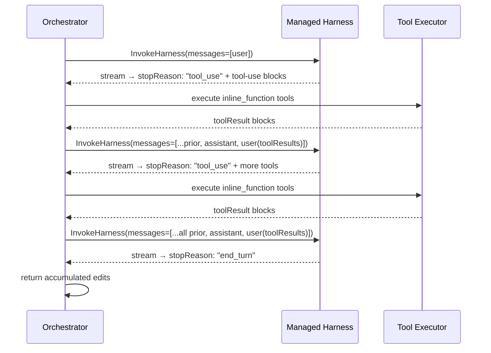

# Design Document: Orchestrator E2E Loop

## Overview

This design transforms the orchestrator Lambda from a demonstration-mode execution (with synthetic failures, fallback sensors, and bundled zip deployment) into a fully functional end-to-end bounded loop. The key changes are:

1. **Multi-turn tool execution** — Both `ManagedHarnessEditorInvocation` and `ManagedHarnessReviewerInvocation` gain a multi-turn loop that detects `stopReason: "tool_use"`, executes `inline_function` tools locally, and re-invokes `InvokeHarness` with `toolResult` content blocks until a terminal stop reason is received.

2. **Docker-based Lambda** — The `NodejsFunction` construct is replaced with `DockerImageFunction` carrying the full toolchain (Node.js 22, CDK CLI, TypeScript, ESLint, Jest) so sensors and `cdk deploy` execute against real CLIs.

3. **Real sensors** — The `safeSensorCall` fallback and `isFirstIteration` synthetic failure are removed. Sensors invoke real CLI tools and propagate real failures.

4. **Real deploy** — `cdk deploy` runs inside the container against an ephemeral preview stack named from the session ID.

5. **Real post-deploy** — HTTP assertions run against the live deployed preview stack endpoint.

## Architecture

```mermaid
graph TD
    subgraph Lambda Container (DockerImageFunction)
        Handler[Lambda Handler]
        MTL[Multi-Turn Loop Engine]
        TE[Tool Executor]
        Sensors[Real Sensors: tsc, eslint, cdk-nag, jest]
        Deploy[cdk deploy]
        PostDeploy[Post-Deploy HTTP Assertions]
        FS[Writable Filesystem /var/task/modules/fanout]
    end

    subgraph AWS
        EditorHarness[Editor Managed Harness]
        ReviewerHarness[Reviewer Managed Harness]
        CFN[CloudFormation Preview Stack]
    end

    Handler --> MTL
    MTL -->|InvokeHarness + toolResult| EditorHarness
    MTL -->|InvokeHarness + toolResult| ReviewerHarness
    MTL --> TE
    TE -->|module.writeFile| FS
    TE -->|module.readFile| FS
    Handler --> Sensors
    Sensors -->|reads| FS
    Handler --> Deploy
    Deploy -->|cdk deploy| CFN
    Handler --> PostDeploy
    PostDeploy -->|HTTP| CFN
```

### Multi-Turn Execution Flow



## Components and Interfaces

### MultiTurnExecutor

A shared engine used by both `ManagedHarnessEditorInvocation` and `ManagedHarnessReviewerInvocation` to drive the multi-turn loop.

```typescript
interface MultiTurnExecutorOptions {
  /** SDK client for InvokeHarness calls. */
  readonly client: BedrockAgentCoreClient;
  /** Harness ARN to invoke. */
  readonly harnessArn: string;
  /** Runtime session ID. */
  readonly sessionId: string;
  /** Registered tool catalogue for inline_function execution. */
  readonly toolCatalogue: ToolCatalogue;
  /** Maximum number of multi-turn round-trips before aborting. */
  readonly maxTurns: number;
}

interface MultiTurnResult {
  /** All messages exchanged across all turns (full conversation). */
  readonly messages: Message[];
  /** The final stop reason that terminated the loop. */
  readonly stopReason: string;
  /** The final assistant message content blocks. */
  readonly finalContent: ContentBlock[];
}
```

### ToolExecutor

Dispatches `inline_function` tool-use blocks to registered handlers.

```typescript
interface ToolCatalogue {
  /** Look up a tool handler by name. Returns undefined if not registered. */
  get(toolName: string): ToolHandler | undefined;
}

interface ToolHandler {
  (input: unknown): Promise<unknown>;
}

interface ToolResultBlock {
  readonly toolUseId: string;
  readonly status: "success" | "error";
  readonly content: string; // JSON-serialized output or error message
}
```

### Updated ManagedHarnessEditorInvocation

Extends the existing class with multi-turn support:

```typescript
interface ManagedHarnessEditorInvocationOptions {
  readonly harnessArn: string;
  readonly sessionId: string;
  readonly client?: BedrockAgentCoreClient;
  /** Tool catalogue for inline_function execution. */
  readonly toolCatalogue: ToolCatalogue;
  /** Max multi-turn round-trips. Default: 20. */
  readonly maxTurns?: number;
}
```

### Updated ManagedHarnessReviewerInvocation

Similarly extended:

```typescript
interface ManagedHarnessReviewerInvocationOptions extends ReviewerHarnessClientOptions {
  readonly toolCatalogue: ToolCatalogue;
  readonly maxTurns?: number;
}
```

### DockerImageFunction Stack Changes

The `OrchestratorStack` replaces `NodejsFunction` with `DockerImageFunction`:

```typescript
// infrastructure/orchestrator-stack.ts
import * as lambda from "aws-cdk-lib/aws-lambda";

this.orchestratorFunction = new lambda.DockerImageFunction(this, "OrchestratorFunction", {
  functionName: "agent-harness-orchestrator",
  code: lambda.DockerImageCode.fromImageAsset(
    path.join(__dirname, ".."),
    { file: "Dockerfile.orchestrator" }
  ),
  timeout: cdk.Duration.seconds(900),
  memorySize: 1024,
  role: this.executionRole,
  environment: {
    EDITOR_HARNESS_ARN: editorArn,
    REVIEWER_HARNESS_ARN: reviewerArn,
  },
});
```

### Dockerfile.orchestrator

```dockerfile
FROM public.ecr.aws/lambda/nodejs:22

# Install global toolchain
RUN npm install -g aws-cdk typescript eslint jest

# Copy project source
COPY package.json package-lock.json tsconfig.json ./
COPY modules/fanout/ ./modules/fanout/
COPY app/ ./app/
COPY agents/ ./agents/
COPY harness/ ./harness/
COPY agent-harness.config.json ./

RUN npm ci --omit=dev

# Lambda handler
CMD ["app/orchestrator/index.handler"]
```

### Updated runLocalSensors (no fallback)

```typescript
export async function runLocalSensors(config: LocalRunnerConfig): Promise<SensorResults> {
  const ctx = makeHandlerContext(config.moduleRoot, config.sessionId, config.iterationIndex);
  const unitTestsTool = createUnitTestsTool();

  const [cdkNag, tsc, eslint, unitTests] = await Promise.all([
    cdkNagTool.handler({}, ctx).then(r => r.output),
    tscTool.handler({}, ctx).then(r => r.output),
    eslintTool.handler({}, ctx).then(r => r.output),
    unitTestsTool.handler({}, ctx).then(r => r.output),
  ]);

  return { cdkNag, tsc, eslint, unitTests };
}
```

### Updated runLocalCdkDeploy (no fallback, session-derived stack name)

```typescript
export async function runLocalCdkDeploy(config: LocalRunnerConfig): Promise<DeployResult> {
  const ctx = makeHandlerContext(config.moduleRoot, config.sessionId, config.iterationIndex);
  const stackName = `preview-${config.sessionId}`;
  const result = await deployTool.handler({ stackName }, ctx);
  return result.output;
}
```

## Data Models

### Message Types (InvokeHarness)

```typescript
interface Message {
  role: "user" | "assistant";
  content: ContentBlock[];
}

type ContentBlock =
  | { text: string }
  | { toolUse: { toolUseId: string; name: string; input: string } }
  | { toolResult: { toolUseId: string; status: "success" | "error"; content: ContentBlockContent[] } };

type ContentBlockContent =
  | { text: string }
  | { json: unknown };
```

### ToolUseBlock (extracted from stream)

```typescript
interface ExtractedToolUse {
  readonly toolUseId: string;
  readonly name: string;
  readonly input: unknown; // parsed JSON
  /** Discriminator: only "tool_use" (inline_function) is executed locally. */
  readonly type: "tool_use" | "server_tool_use" | "mcp_tool_use";
}
```

### DeployResult (updated)

```typescript
interface DeployResult {
  readonly outcome: "ok" | "failed";
  readonly logs: string;
  readonly stackOutputs?: Record<string, string>;
  readonly stackName?: string;
}
```

### PostDeployResult

```typescript
interface PostDeployResult {
  readonly outcome: "passed" | "failed" | "deploy-failure";
  readonly report: {
    assertions: Array<{
      name: string;
      passed: boolean;
      expected?: unknown;
      actual?: unknown;
    }>;
  };
}
```

## Correctness Properties

*A property is a characteristic or behavior that should hold true across all valid executions of a system — essentially, a formal statement about what the system should do. Properties serve as the bridge between human-readable specifications and machine-verifiable correctness guarantees.*

### Property 1: Multi-turn message history invariant

*For any* sequence of N multi-turn round-trips (where each round-trip produces tool-use blocks followed by tool results), the messages array passed to the (N+1)th `InvokeHarness` call SHALL contain all prior assistant messages (with tool-use blocks) and all prior user messages (with toolResult blocks) in chronological order, plus the original user message at position 0.

**Validates: Requirements 1.3, 10.1, 10.2**

### Property 2: Multi-turn loop terminates on terminal stop reason

*For any* sequence of InvokeHarness responses where the first K responses have `stopReason: "tool_use"` and response K+1 has a terminal stop reason (any value other than `"tool_use"`), the multi-turn loop SHALL execute exactly K+1 InvokeHarness calls and return without error (for `"end_turn"`) or with accumulated results (for other terminal reasons).

**Validates: Requirements 1.2, 1.5, 2.2**

### Property 3: Tool executor produces correct result blocks

*For any* tool-use block with a registered tool name, if the handler returns successfully the executor SHALL produce a toolResult with `status: "success"` and JSON-serialized output; if the handler throws, the executor SHALL produce a toolResult with `status: "error"` and the error message as text content. In both cases the `toolUseId` in the result SHALL match the `toolUseId` in the request.

**Validates: Requirements 3.1, 3.2, 3.3**

### Property 4: Server and MCP tool-use blocks are skipped

*For any* mix of content blocks where some have `type: "tool_use"` (inline_function), some have `type: "server_tool_use"`, and some have `type: "mcp_tool_use"`, the tool executor SHALL only execute blocks with `type: "tool_use"` and SHALL produce no toolResult blocks for server or MCP tool-use blocks.

**Validates: Requirements 10.3**

### Property 5: Session-derived stack name uniqueness

*For any* two distinct session IDs, the stack names derived from them SHALL be distinct. *For any* single session ID, the derived stack name SHALL be a valid CloudFormation stack name (alphanumeric + hyphens, 1-128 chars).

**Validates: Requirements 6.2**

### Property 6: Post-deploy outcome reflects assertion results

*For any* set of HTTP assertions where all pass, the post-deploy harness SHALL return `outcome: "passed"` with a report containing each assertion marked as passed. *For any* set where at least one fails, it SHALL return `outcome: "failed"` with the failing assertion's expected and actual values in the report.

**Validates: Requirements 7.2, 7.3**

### Property 7: File write round-trip on container filesystem

*For any* valid file path (relative to moduleRoot) and file contents, calling `module.writeFile` through the tool executor and then reading the file from the filesystem at the resolved path SHALL yield the same contents.

**Validates: Requirements 8.2**

### Property 8: toolResult blocks match tool-use blocks by toolUseId

*For any* assistant message containing N tool-use blocks with unique toolUseIds, the subsequent user message produced by the multi-turn loop SHALL contain exactly N toolResult blocks, each with a `toolUseId` matching one of the original tool-use blocks (bijection).

**Validates: Requirements 1.1, 2.1, 10.1**

## Error Handling

| Scenario | Behaviour |
|----------|-----------|
| InvokeHarness SDK throw (network, throttle, access-denied) | Propagates to `runLoop()` which records the iteration as failed |
| In-band `internalServerException` / `validationException` / `runtimeClientError` | Re-thrown from stream walker; same propagation as SDK throw |
| Stream ends without `messageStop` | Throw — malformed response |
| Multi-turn cycle exceeds `maxTurns` | Throw `MaxTurnsExceededError` with turn count and last stop reason |
| Tool handler throws | Produce `toolResult` with `status: "error"`; loop continues |
| Unknown tool name requested | Produce `toolResult` with `status: "error"` and "tool not registered" message; loop continues |
| `cdk deploy` fails (non-zero exit) | Return `DeployResult { outcome: "failed", logs }` — loop evaluates stop conditions |
| Sensor CLI not found (ENOENT) | Error propagates (no fallback) — forces investigation of Docker image |
| Post-deploy HTTP assertion timeout | Return `outcome: "failed"` with timeout info in report |
| `stackOutputs` undefined when post-deploy is called | Return `outcome: "deploy-failure"` — no HTTP requests attempted |

## Testing Strategy

### Unit Tests (example-based)

- **Tool executor with unregistered tool** — verifies error result (Req 3.4)
- **safeSensorCall removal** — verifies ENOENT propagates from sensors (Req 5.5)
- **safeSensorCall removal for deploy** — verifies ENOENT propagates from cdk deploy (Req 6.5)
- **isFirstIteration removal** — verifies first iteration uses real sensors (Req 9.1)
- **Post-deploy with no stackOutputs** — verifies deploy-failure outcome (Req 7.4)
- **moduleRoot resolution** — verifies container path (Req 8.3)

### Property-Based Tests

Property-based testing library: **fast-check** (already available in the project's test dependencies).

Each property test runs a minimum of 100 iterations and is tagged with its design property reference.

| Property | Tag | Strategy |
|----------|-----|----------|
| Property 1: Message history invariant | `Feature: orchestrator-e2e-loop, Property 1: Multi-turn message history invariant` | Generate random multi-turn sequences (1–10 turns), each with 1–5 tool-use blocks. Verify messages array correctness after each turn. |
| Property 2: Loop termination | `Feature: orchestrator-e2e-loop, Property 2: Multi-turn loop terminates on terminal stop reason` | Generate K (0–maxTurns-1) tool_use rounds + 1 terminal round. Verify exactly K+1 calls and correct return. |
| Property 3: Tool executor results | `Feature: orchestrator-e2e-loop, Property 3: Tool executor produces correct result blocks` | Generate random tool names, inputs, and handler outcomes (success/error). Verify result block structure. |
| Property 4: Server/MCP skip | `Feature: orchestrator-e2e-loop, Property 4: Server and MCP tool-use blocks are skipped` | Generate random mixes of block types. Verify only inline_function executed. |
| Property 5: Stack name uniqueness | `Feature: orchestrator-e2e-loop, Property 5: Session-derived stack name uniqueness` | Generate pairs of random session IDs. Verify derived names are distinct and valid. |
| Property 6: Post-deploy outcome | `Feature: orchestrator-e2e-loop, Property 6: Post-deploy outcome reflects assertion results` | Generate random assertion sets (all-pass and mixed). Verify outcome and report. |
| Property 7: File write round-trip | `Feature: orchestrator-e2e-loop, Property 7: File write round-trip on container filesystem` | Generate random paths and contents. Verify write-then-read identity. |
| Property 8: toolResult bijection | `Feature: orchestrator-e2e-loop, Property 8: toolResult blocks match tool-use blocks by toolUseId` | Generate random tool-use block sets. Verify 1:1 toolUseId mapping in results. |

### Integration Tests

- **Real sensor execution** — invoke sensors against `modules/fanout/` in the Docker container (Req 5.1–5.4)
- **Real cdk deploy** — deploy an ephemeral stack and verify outputs are captured (Req 6.1, 6.3, 6.4)
- **Real post-deploy** — run HTTP assertions against a deployed preview stack (Req 7.1)
- **Full loop E2E** — trigger the Lambda with a real payload and verify it completes the bounded loop

### Infrastructure Tests (CDK assertions)

- **DockerImageFunction in template** — CDK synth and assert Docker-based Lambda (Req 4.1)
- **Same IAM/env/timeout/memory** — compare synthesized template with expected config (Req 4.4)
