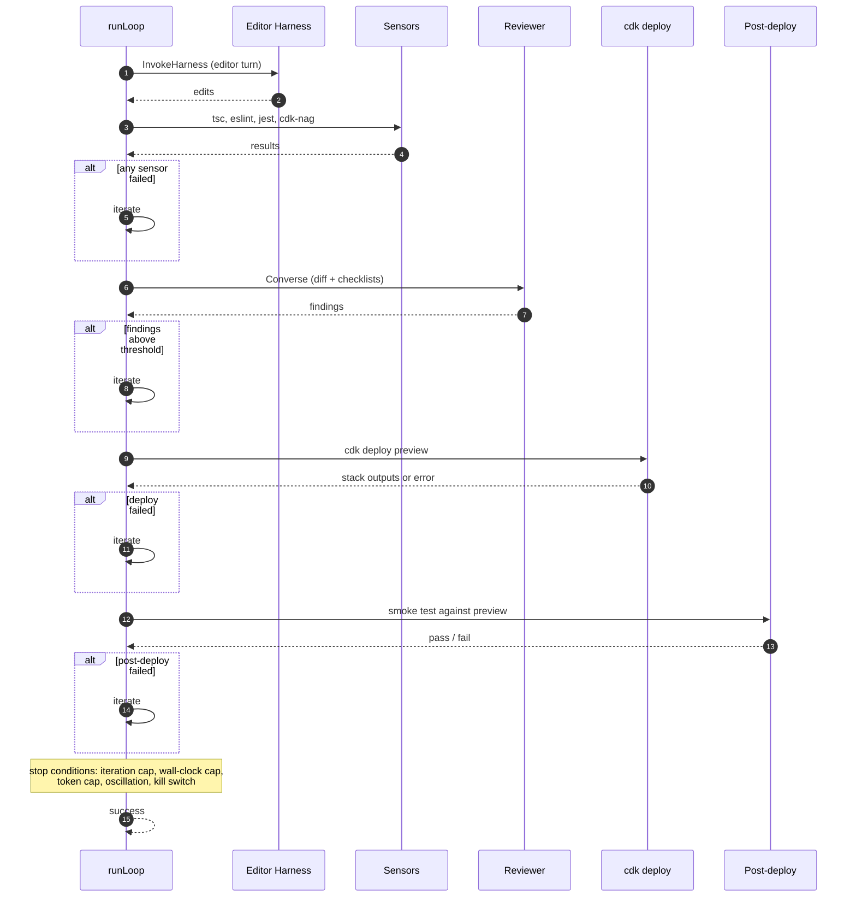

# agent-harness

> Companion post: [Two harnesses every coding agent needs, and why sensors beat prompts](#) (link to come once published)

A template for a bounded closed loop that lets an editing agent maintain a CDK module autonomously. The agent edits code, four sensors check it, a reviewer model evaluates the diff, `cdk deploy` pushes to a preview environment, and a post-deploy harness validates the live stack. The loop iterates until all gates pass or a stop condition fires. A human reviews the result.

The runtime harness is [AgentCore Managed Harness](https://docs.aws.amazon.com/bedrock-agentcore/latest/devguide/harness.html) (AWS-managed orchestration, sessions, tool wiring). The engineering harness (sensors, reviewer, deploy gate, post-deploy) is custom code in a CodeBuild orchestrator. The engineering harness is where the template's value sits.

---

## Two task types

**Task 1: Feature change.** A human describes a change. The agent does it.

```powershell
./scripts/setup.ps1 -AccountId "<your-account>" -FromStep 5b -TaskType feature
```

**Task 2: Autonomous discovery.** A reviewer model scans the module, finds architecture gaps, and triggers the same loop to fix the top finding.

```powershell
./scripts/setup.ps1 -AccountId "<your-account>" -FromStep 5b -TaskType discover
```

Both use the same bounded loop. The trigger mechanism is a script; in production, the same JSON payload could arrive from a CI/CD webhook, a labeled issue, a Slack command, or a scheduled cron job.

---

## Architecture

What `runLoop` does each iteration:



**Runtime harness**: Editor Managed Harness (AgentCore: model, tools, session state).
**Engineering harness**: sensors, reviewer, `cdk deploy`, post-deploy harness (custom code in CodeBuild).

---

## Is this useful for you?

- **Are you maintaining infrastructure-as-code?** The template is in the right shape. Application code needs different sensors.
- **Can you stand up an ephemeral preview environment?** The post-deploy half of the loop needs one.
- **Are you on AWS with CDK?** The template is AWS/CDK-specific. Porting to Terraform or other clouds is real work.
- **Are you comfortable running a Bedrock-backed agent that edits IaC?** The template assumes yes.
- **Will your team maintain the engineering harness over time?** Steering files and sensors need updating as your module evolves.

If most answers are yes, fork and adapt. If not, treat the companion post's framing as the contribution.

---

## Prerequisites

- AWS account with permission to create CodeBuild projects, IAM roles, and CDK stacks
- [AgentCore Managed Harness](https://aws.amazon.com/bedrock/agentcore/) access
- Bedrock model access (default: Claude Sonnet)
- Node.js 22.x (see `.nvmrc`)
- AWS CDK v2 (`npm install -g aws-cdk@2`)

---

## Quickstart

```powershell
# 1. Deploy infrastructure (CDK bootstrap, IAM, CodeBuild, AgentCore harnesses)
./scripts/setup.ps1 -AccountId "<your-account>"

# 2. Run Task 1: human-initiated feature change
./scripts/setup.ps1 -AccountId "<your-account>" -FromStep 5b -TaskType feature

# 3. Run Task 2: system discovers a gap and fixes it
./scripts/setup.ps1 -AccountId "<your-account>" -FromStep 5b -TaskType discover
```

See [`docs/quickstart.md`](docs/quickstart.md) for the detailed setup guide.

---

## Repository structure

```
agents/
  editor/                         # Editor agent (system prompt, tool catalogue)
  reviewer/                       # Reviewer agent (system prompt, checklists, tools)
  shared/                         # Shared wrapper plumbing

app/
  codebuild/                      # CodeBuild orchestrator (bounded loop runner, gates)
  orchestrator/                   # Multi-turn executor (AgentCore SDK)

harness/
  loop/                           # Bounded loop runner (runLoop, stop conditions, session)
  post-deploy/                    # Synthetic post-deploy harness
  scheduled-reviewer/             # Reviewer invocation for discovery mode

infrastructure/
  app.ts                          # CDK app entry point
  codebuild-orchestrator-stack.ts # CodeBuild project + IAM
  iam-stack.ts                    # AgentCore harness IAM roles

modules/
  fanout/                         # Reference CDK module (API GW -> Lambda -> SNS -> SQS -> Lambda)
    AGENTS.md                     # Steering file for the editor agent

scripts/
  setup.ps1 / setup.sh           # Automated setup and task runner
  deploy-harnesses.ts             # Deploy AgentCore harnesses via CreateHarness API
  discover-gaps.js                # Reviewer discovery (Task 2 trigger)
  check-version-drift.ts          # Version-pin validation

agent-harness.config.json         # Single source of truth for config and version pins
buildspec.yml                     # CodeBuild build specification
```

---

## Configuration

All configurable values live in `agent-harness.config.json`:

| Field | Default | Description |
|---|---|---|
| `module.path` | `modules/fanout` | CDK module the agent maintains |
| `models.editor` | Claude Sonnet | Bedrock model for the editor |
| `models.reviewer` | Claude Sonnet | Bedrock model for the reviewer |
| `limits.iterationCap` | 8 | Max iterations per task |
| `limits.wallClockCapMinutes` | 12 | Max wall-clock time per task |
| `limits.tokenSpendCapUSD` | 10.0 | Max token spend per task |
| `sensors.cdkNagRulePack` | `AwsSolutions` | cdk-nag rule pack |
| `sensors.reviewerSeverityThreshold` | `MEDIUM` | Minimum severity that blocks the loop |
| `oscillation.sameDiffWindow` | 5 | Same diff repeated N times triggers stop |
| `oscillation.alternationWindow` | 6 | A-B-A-B pattern over N iterations triggers stop |

Version pins are in the `versions` section. Run `npm run check-version-drift` to verify they match installed packages.

---

## Stop conditions

The loop stops in one of these ways:

| Condition | Default | Outcome |
|-----------|---------|---------|
| Success | n/a | All gates passed. Done. |
| Iteration cap | 8 | Stop, surface session log |
| Wall-clock cap | 12 min | Stop, surface session log |
| Token-spend cap | $10 | Stop, surface session log |
| Oscillation | 5-6 iterations | Stop, surface session log |
| Kill switch | Manual | Stop immediately |

Every non-success termination surfaces the full session record so a human can see exactly where the agent stopped and why.

---

## What this template does not do

- **Autonomous production deployment.** A human reviews the output. The loop closes on the preview, not on production.
- **Multi-agent coordination.** One agent, one task, one preview.
- **Harness self-evolution.** The agent does not edit its own steering files or sensors.
- **Full correctness guarantee.** Sensors reduce risk; they don't eliminate it.

---

## In production

The template triggers the loop from a script. In a team's workflow, the same JSON payload arrives from any dispatch mechanism:

- A labeled GitHub/GitLab issue
- A CI/CD webhook
- A Slack command or internal dashboard
- A scheduled cron job (for Task 2 discovery)

The loop is platform-agnostic. The integration is straightforward CI/CD wiring.

---

## License

Apache 2.0. See [LICENSE](LICENSE).
